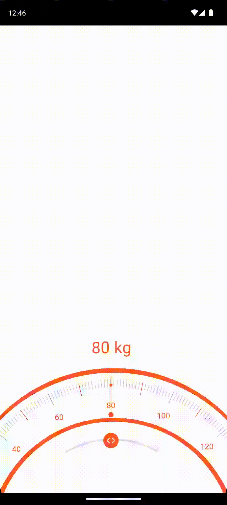
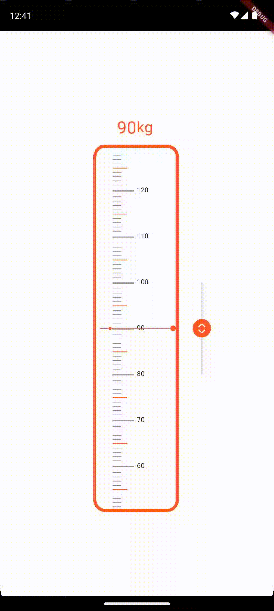

awesome_gauge is a package for build gauge.

## Features

curve gauge

horizontal gauge

vertical gauge

## Getting started

TODO: List prerequisites and provide or point to information on how to
start using the package.

## Usage

[main.dart](example/lib/main.dart)
